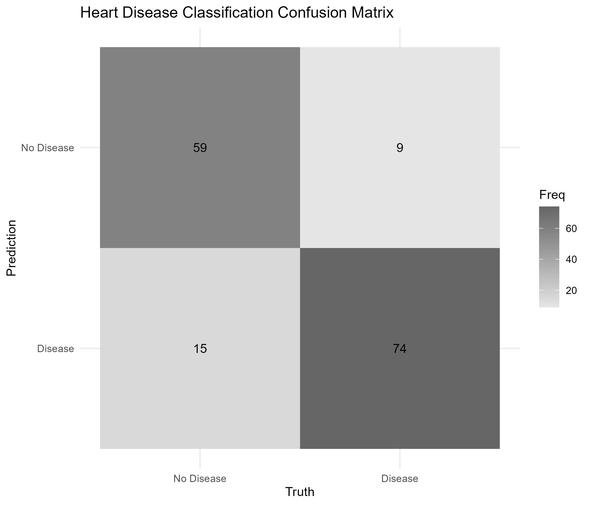

# Heart Disease Classification with Logistic Regression

## Overview

This project uses **logistic regression** to classify the presence or absence of heart disease using the UCI Heart Disease dataset.

The analysis demonstrates an end-to-end machine learning workflow in R, including data preprocessing, stratified train/test splitting, missing-value imputation, categorical-variable encoding, model fitting, prediction, and evaluation on unseen test data.

## Objective

The primary question is:

**Can patient clinical characteristics be used to classify the presence of heart disease?**

This project focuses on classification rather than estimating an individual's future cardiovascular risk.

## Tools Used

- **R**
- **tidyverse** — data manipulation and cleaning
- **tidymodels** — preprocessing, model specification, workflows, and evaluation
- **ggplot2** — visualization

## Data

The analysis uses the **UCI Heart Disease dataset**, which contains clinical characteristics associated with heart disease diagnosis.

The dataset used for this analysis is stored in the [`data`](data/) folder as:

`heart_disease_uci.csv`

The original multiclass diagnosis variable was converted into a binary outcome:

- **No Disease** — original diagnosis value of 0
- **Disease** — original diagnosis value greater than 0

## Modeling Workflow

### 1. Train/Test Split

The data were divided into:

- **80% training data**
- **20% testing data**

Stratified sampling was used to preserve the distribution of the outcome variable across the two datasets.

### 2. Data Preprocessing

A `tidymodels` recipe was used to:

- Impute missing numeric values using the median
- Impute missing categorical values using the mode
- Convert categorical predictors into dummy variables
- Remove zero-variance predictors

Importantly, preprocessing was defined using the training data to avoid information leakage from the test set.

### 3. Logistic Regression

A binary logistic regression classifier was specified using the `glm` engine and incorporated into a reproducible `tidymodels` workflow.

The model was fitted using the training dataset.

### 4. Model Evaluation

Predictions were generated for the held-out test dataset.

Model performance was evaluated using:

- Accuracy
- Cohen's kappa
- ROC AUC
- Confusion matrix

## Confusion Matrix

The confusion matrix provides a comparison between the model's predicted classifications and the observed heart disease outcomes.



The figure is generated automatically by the R analysis script.

## Repository Structure

```text
cardiovascular-risk-logistic-regression/
│
├── data/
│   ├── heart_disease_uci.csv
│   └── README.md
│
├── figures/
│   ├── heart_disease_cm.png
│   └── README.md
│
├── scripts/
│   └── heart_disease_logistic_regression.R
│
├── .gitignore
├── LICENSE
└── README.md
```

## Reproducing the Analysis

1. Clone or download this repository.
2. Open the project directory in R or RStudio.
3. Install the required packages if necessary:

```r
install.packages(c(
  "tidyverse",
  "tidymodels"
))
```

4. Run:

```text
scripts/heart_disease_logistic_regression.R
```

The script reads the dataset from the `data` folder, performs preprocessing and model fitting, evaluates performance on the test set, and saves the confusion matrix to the `figures` folder.

## Full Project Write-Up

For a more detailed discussion of this project, visit:

**[Predicting Cardiovascular Risk with Logistic Regression — tobiadenola.com](https://tobiadenola.com/predicting-cardiovascular-risk-with-logistic-regression/)**

## Author

**Oluwatobiloba Adenola**

Data analyst and researcher with experience in R, SQL, statistical modeling, and data visualization.

[Portfolio](https://tobiadenola.com/)
